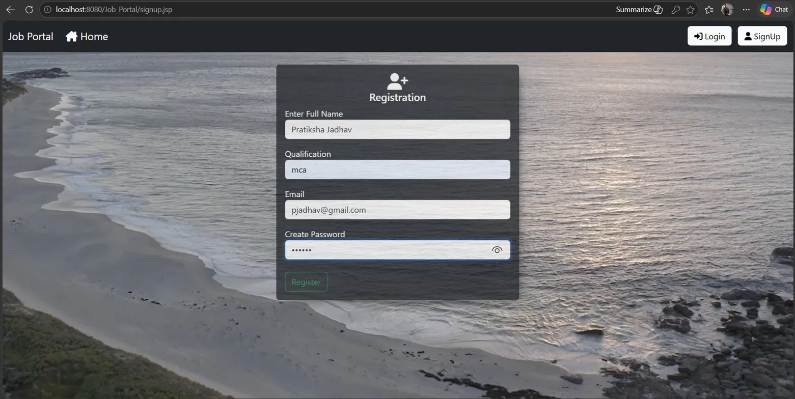
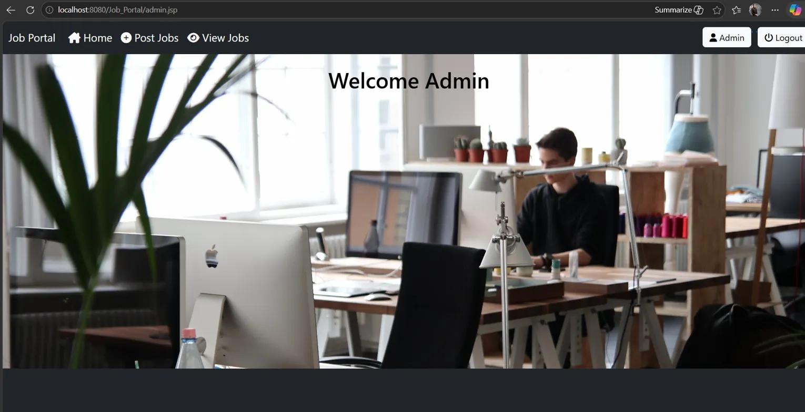
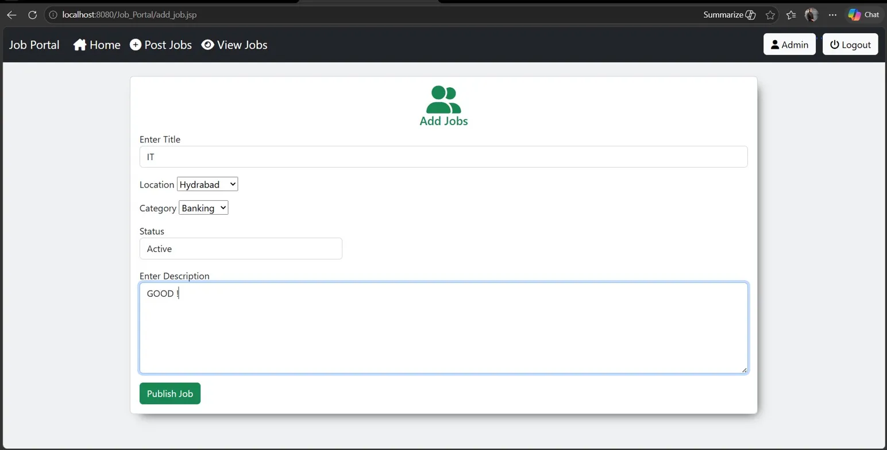
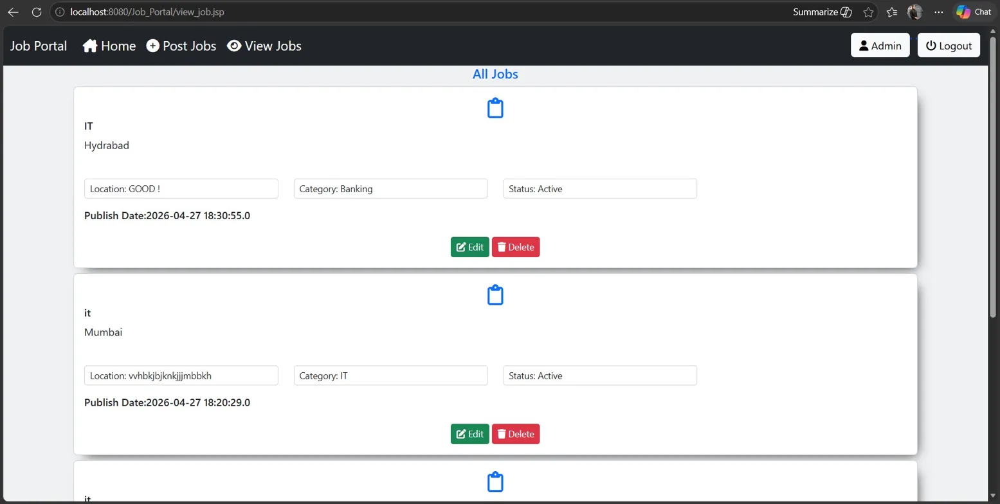

# 💼 Job Portal Web Application

The Job Portal is a full-stack web application built using Java Servlets, JSP, and MySQL. It allows users to browse and apply for jobs while admins can manage all job postings easily.

---

## 🎯 Objectives

* Replace manual job listing and management process
* Provide a platform for job seekers to find jobs easily
* Allow admins to post and manage job listings efficiently
* Improve accuracy and speed of job search
* Provide a secure login system for users and admin

---

## ✨ Features

* User registration and login
* Admin dashboard for job management
* Post, edit, and delete job listings
* Browse and search job listings by location and category
* View detailed job information
* Secure authentication system
* Fast and responsive UI using JSP and CSS

---

## 🛠️ Technologies Used

* Java
* JSP (JavaServer Pages)
* Java Servlets
* MySQL Database
* Apache Tomcat 9
* HTML / CSS
* JDBC (Java Database Connectivity)
* Eclipse IDE

---

## 🗄️ Database (MySQL)

* Stores user and admin data
* Stores all job listings
* Tracks job category and location
* Email uniqueness maintained for users
* Can be upgraded or migrated easily

---

## ⚙️ How It Works

* User registers with name, email and password
* User logs in and browses available jobs
* Admin logs in with admin credentials
* Admin posts new job with title, description, location, category
* Job listings are saved in MySQL database
* Users can view all jobs on home page
* Admin can edit or delete any job listing

---

## 📸 Screenshots

### 🏠 Index / Landing Page


### 📝 Registration Page


### 🏠 Home Page - All Jobs


### 🔍 More View Page


### 🔐 Admin Dashboard


### ➕ Add Job Page (Admin)


### 👁️ View Jobs Page (Admin)


---

## 📂 Project Structure

* `src/main/java/com/dao/` → Database access (UserDAO, JobDAO)
* `src/main/java/com/servlet/` → Servlets (Login, Register, AddPost)
* `src/main/java/com/model/` → Model classes (User, Job)
* `src/main/webapp/` → JSP pages
* `home.jsp` → Home page with job listings
* `login.jsp` → Login page
* `signup.jsp` → Registration page
* `admin.jsp` → Admin dashboard
* `add_job.jsp` → Add new job
* `edit_job.jsp` → Edit existing job
* `view_job.jsp` → View all jobs
* `more_view.jsp` → Detailed job view
* `WEB-INF/web.xml` → Configuration file
* `all_component/` → Navbar, Footer, CSS

---

## 🔧 Installation

* git clone https://github.com/pratikshajadhav24/Job_Portal.git
* Import project in Eclipse
* Configure Apache Tomcat 9 in Eclipse
* Setup MySQL database

---

## 🗄️ Database Setup

```sql
CREATE DATABASE job_portal;
USE job_portal;

CREATE TABLE user (
    id INT AUTO_INCREMENT PRIMARY KEY,
    name VARCHAR(100) NOT NULL,
    email VARCHAR(100) NOT NULL UNIQUE,
    password VARCHAR(100) NOT NULL,
    role VARCHAR(20) DEFAULT 'user'
);

CREATE TABLE jobs (
    id INT AUTO_INCREMENT PRIMARY KEY,
    title VARCHAR(255) NOT NULL,
    description TEXT,
    location VARCHAR(255),
    category VARCHAR(255),
    salary VARCHAR(100),
    company VARCHAR(255),
    posted_date DATETIME DEFAULT CURRENT_TIMESTAMP
);
```

---

## ▶️ Run Project

* Open Eclipse → Import Project
* Right click on project → Run As → Run on Server
* Select Apache Tomcat 9 → Finish
* Open: http://localhost:8080/Job_Portal/

---

## 📌 Applications

* Job seekers looking for employment
* Companies posting job vacancies
* Placement cells in colleges
* Recruitment agencies
* HR departments in organizations

---

## 🚀 Future Improvements

* Resume upload feature
* Email notification on job apply
* Job search and filter by category/location
* Mobile responsive design
* Deploy on cloud (AWS / Heroku)
* Admin analytics dashboard
* Chat between recruiter and applicant

---

## 👩‍💻 Author

**Pratiksha Jadhav**  
Java Web Development Project  
Pune, Maharashtra

---

## ⭐ Conclusion

This Job Portal system automates the job listing and application process using Java and MySQL. It improves efficiency compared to manual systems and provides a clean interface for both users and admins.
